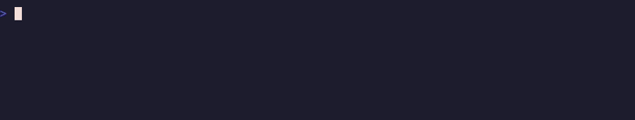

# agent-tmux

A two-row tmux status bar for people who run a lot of coding agents at once.

The top row is your theme's window tabs, untouched. The bottom row is a rail of
**numbered session pills** — jump to any session with one keystroke or a click.
And when a Claude Code or Codex agent in a pane needs you, its **window tab
changes color**, so you can see which of thirty panes is waiting without looking
at any of them.


## What you get

**The session rail (row 1).** Every session, numbered alphabetically, current one
on the accent pill. `prefix` + `1..9` jumps. Clicking a pill switches to it. The
`+` button on the left opens the project picker.

**Agent tab colors (row 0).** The window tab shows the highest-priority state
across *its panes*, so one split never hides another:

| color | state | meaning |
|-------|-------|---------|
| 🔴 red | `blocked` | a pane wants a permission or asked a question |
| 🟡 yellow | `waiting` | a pane finished its turn — your move |
| 🔵 blue | `working` | a pane is busy, nothing needs you |
| 🟢 green | `done` | manually acked with `prefix` + `g` |


Priority is `blocked > waiting > working > done`. A window with one blocked pane
and one working pane reads red.



**Two pickers.** `prefix` + `p` fuzzy-finds a project directory and switches to
(or creates) a session for it. `prefix` + `o` fuzzy-finds an existing session,
with a live preview and `ctrl-d` to kill.

## Requirements

- tmux **3.2+** (uses `display-popup`, `#[fill=]`, `range=user`)
- `bash` and `fzf`
- Optional: `jq`, for exact background-task detection in the Claude hook payload

## Install

With [TPM](https://github.com/tmux-plugins/tpm), in `~/.tmux.conf`:

```tmux
set -g @plugin 'Lev-Stambler/agent-tmux'
set -g @agent_tmux_paths "$HOME/code:$HOME/work"   # where prefix+p looks

run '~/.tmux/plugins/tpm/tpm'
```

Then `prefix` + `I` to fetch it.

Load it **after** your theme if you use one, so its palette options exist first.
Nothing breaks if you don't — this plugin only writes `status-format[1]`, which
themes like catppuccin never touch.

Without TPM, clone it and source the entrypoint at the end of your config:

```tmux
run '~/path/to/agent-tmux/agent-tmux.tmux'
```

## Wiring the agent colors

The status bar and pickers work immediately. The tab colors need your agents to
report their lifecycle, which is two bits of config outside tmux.

### Claude Code

In `~/.claude/settings.json` — `$AT` is wherever you cloned the plugin
(`tmux show-option -gv @agent_tmux_dir` prints it):

```json
{
  "hooks": {
    "SessionStart":     [{ "hooks": [{ "type": "command", "command": "$AT/scripts/agent-status.sh clear" }] }],
    "UserPromptSubmit": [{ "hooks": [{ "type": "command", "command": "$AT/scripts/agent-status.sh working" }] }],
    "PostToolUse":      [{ "hooks": [{ "type": "command", "command": "$AT/scripts/agent-status.sh working" }] }],
    "Stop":             [{ "hooks": [{ "type": "command", "command": "$AT/scripts/agent-status.sh waiting" }] }],
    "PermissionRequest":[{ "hooks": [{ "type": "command", "command": "$AT/scripts/agent-status.sh blocked" }] }],
    "SessionEnd":       [{ "hooks": [{ "type": "command", "command": "$AT/scripts/agent-status.sh clear" }] }]
  }
}
```

### Codex

Codex's TUI does not fire per-turn hooks; its end-of-turn signal is the `notify`
program. In `~/.codex/config.toml`:

```toml
notify = ["/absolute/path/to/agent-tmux/scripts/agent-status-notify.sh"]
```

> **This must be an absolute path, and `~/.codex/config.toml` is probably not in
> your dotfiles repo.** That makes it the single easiest piece of this setup to
> lose on a new machine — and when it goes missing, Codex tabs simply never
> color, with no error anywhere. If your Codex tabs are dead, check this first.

Codex also needs to run its TUI **in-process**, or the hooks fire detached from
the pane and `$TMUX_PANE` is empty. A shell wrapper does it:

```bash
codex() {
  case "$1" in
    exec|e|review|login|logout|mcp|mcp-server|app-server|exec-server|remote-control|completion|update|doctor|sandbox|debug|apply|a|archive|unarchive|cloud|features|help)
      command codex "$@" ;;
    *)
      command codex -c features.tui_app_server=false "$@" ;;
  esac
}
```

There is a cwd-based fallback for when `$TMUX_PANE` is missing, but it can only
resolve a pane when exactly one Codex pane is running in that directory.

## Keys

| key | does |
|-----|------|
| `prefix` + `1..9` | jump to the Nth session (the numbers on row 1) |
| click a pill | switch to that session |
| click `+` | open the project picker |
| `prefix` + `p` | project picker (fuzzy-find a directory) |
| `prefix` + `o` | session picker (fuzzy-find a session, `ctrl-d` kills) |
| `prefix` + `g` | mark the current pane acked (green) |
| `prefix` + `G` | clear the current pane's state |

### Optional: `Ctrl+Alt+N` instead of `prefix` + `N`

Faster, but legacy terminal encoding cannot express `Ctrl+digit`, so your
terminal has to emit the CSI-u chord explicitly. Opt in with:

```tmux
set -g @agent_tmux_jump_keys 'both'   # prefix | chord | both | off
```

<details>
<summary>Ghostty</summary>

```ini
keybind = ctrl+alt+digit_1=csi:49;7u
keybind = ctrl+alt+digit_2=csi:50;7u
keybind = ctrl+alt+digit_3=csi:51;7u
keybind = ctrl+alt+digit_4=csi:52;7u
keybind = ctrl+alt+digit_5=csi:53;7u
keybind = ctrl+alt+digit_6=csi:54;7u
keybind = ctrl+alt+digit_7=csi:55;7u
keybind = ctrl+alt+digit_8=csi:56;7u
keybind = ctrl+alt+digit_9=csi:57;7u
```
</details>

<details>
<summary>Alacritty</summary>

```toml
[keyboard]
bindings = [
  { key = "1", mods = "Control|Alt", chars = "" },
  { key = "2", mods = "Control|Alt", chars = "" },
  { key = "3", mods = "Control|Alt", chars = "" },
  { key = "4", mods = "Control|Alt", chars = "" },
  { key = "5", mods = "Control|Alt", chars = "" },
  { key = "6", mods = "Control|Alt", chars = "" },
  { key = "7", mods = "Control|Alt", chars = "" },
  { key = "8", mods = "Control|Alt", chars = "" },
  { key = "9", mods = "Control|Alt", chars = "" },
]
```
</details>

You will also want `set -g extended-keys on`.

## Options

| option | default | what |
|--------|---------|------|
| `@agent_tmux_paths` | `$HOME/code` | colon-separated roots for `prefix` + `p` |
| `@agent_tmux_jump_keys` | `prefix` | `prefix` \| `chord` \| `both` \| `off` |
| `@agent_tmux_button_label` | `+` | picker button glyph; `off` hides it |
| `@agent_tmux_colors` | `on` | `off` disables the agent state colors |
| `@agent_tmux_row` | `1` | which status row holds the rail |
| `@agent_tmux_status_interval` | `15` | redraws are hook-driven; this is a backstop |
| `@agent_tmux_picker` | bundled | command the picker button and `prefix`+`p` run |

Colors, all Catppuccin Mocha by default:

| option | default | what |
|--------|---------|------|
| `@agent_tmux_accent` | `#cba6f7` | current-session pill |
| `@agent_tmux_accent_fg` | `#11111b` | text on filled pills |
| `@agent_tmux_pill_bg` | `#313244` | other-session pills |
| `@agent_tmux_pill_fg` | `#a6adc8` | text on dim pills |
| `@agent_tmux_band` | `#181825` | row 1 background |
| `@agent_tmux_button_bg` / `_fg` | `#313244` / `#cba6f7` | the picker button |
| `@agent_tmux_state_blocked` | `#f38ba8` | tab color: blocked |
| `@agent_tmux_state_waiting` | `#f9e2af` | tab color: your move |
| `@agent_tmux_state_working` | `#89b4fa` | tab color: busy |
| `@agent_tmux_state_acked` | `#a6e3a1` | tab color: acked |

## How it composes with your theme

The rail lives on `status-format[1]`, which themes do not write — so it cannot
collide, and load order does not matter for it.

The tab colors set `window-status-format` **per window**, while a theme sets it
globally. Your theme's value is never overwritten; clearing a pane's state
removes the per-window override and the theme shows through again, verbatim.
There is a regression test for exactly this.

## Tests

```sh
bash tests/tmux-sessions.test.sh    # the rail: numbering, pills, jump, click, button
bash tests/agent-status.test.sh     # state aggregation, theme restoration, palette
tests/vhs/run.sh                    # renders real tmux and pixel-samples the colors
```

The first two use a throwaway `tmux -L <socket>` server and never touch your live
sessions. The VHS suite renders an actual session against a self-contained config
and asserts the *rendered pixels*, which is the only layer that can catch a
status-format regression. It needs `vhs`, `ttyd`, `ffmpeg` and ImageMagick.

## Known limits

- The Codex cwd-fallback walks the process tree. On Linux it reads `/proc`; on
  macOS it falls back to BSD `ps`. The normal `$TMUX_PANE` path is unaffected.
- `prefix` + `p` and `prefix` + `o` overwrite tmux's defaults for those keys
  (`previous-window` and `select-pane -t :.+`). Rebind them if you want them back.
- The rail lists every session on the server, so it gets crowded past ~10
  sessions on a narrow terminal.

## License

MIT
