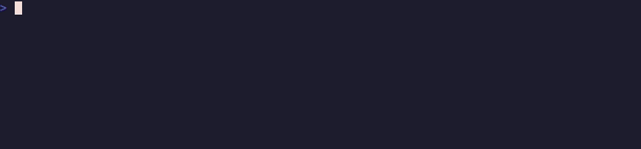
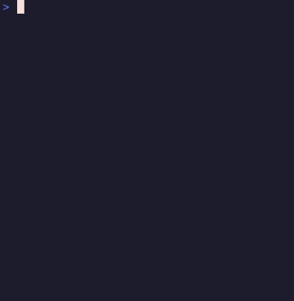

# agent-tmux

A two-row tmux status bar for people who run a lot of coding agents at once.

The top row is your theme's window tabs, plus three buttons — **new window,
split, split** — and a border around the window you are on. The bottom row is a
rail of **numbered session pills** — jump to any session with one keystroke or a
click. And when a Claude Code or Codex agent in a pane needs you, its **window
tab changes color**, so you can see which of thirty panes is waiting without
looking at any of them.


## What you get

**The session rail (row 1).** Every session, numbered alphabetically, current one
on the accent pill. `prefix` + `1..9` jumps. Clicking a pill switches to it. The
`+` button on the left opens the project picker.

**Window buttons and the current-window border (row 0).** Three pills at the
left of your theme's row:

| button | does | equivalent |
|--------|------|------------|
| `+` | new window, next to this one, in the same directory | `prefix` + `c` |
| `│` | split the pane left/right | `prefix` + `%` |
| `────` | split the pane top/bottom | `prefix` + `"` |


The window you are on is drawn inside a `▏ ▕` border in the accent colour, so
the selected tab is obvious even when your theme's active-tab colour is subtle —
or when an agent has repainted that tab red. Everything else on row 0 is still
your theme's: the plugin prepends one format reference and leaves the rest
alone.

**The pane you are in (no columns at all).** The active pane's frame takes the
accent colour, every other border goes dim, and borders are drawn heavy with
tmux's arrow indicators on — so with four splits of agent output you can see
where your keystrokes are going without moving anything. This costs no status
space: tmux draws those borders anyway. In a window whose agent has a state, the
state's colour takes over the active pane's border — the *active* one only, so a
window full of splits still shows you where you are.

**Explode a window into full-screen tabs (`prefix` + `e`).** A window holding
four agents shows *one* blended tab colour, and each agent gets a quarter of the
screen. Press `prefix` + `e` and every pane becomes its own full-screen window —
`agents`, `agents·2`, `agents·3` — so each agent gets a whole screen **and its own
coloured tab**: the tab row turns into a board of every agent's state. Press it
again, from any of those tabs, and the window comes back with its layout
restored exactly.



The colours follow the panes, which is the point: the tab a pane left stops
claiming its state and the tab it joined picks it up. A zoomed pane comes back
zoomed. Exact restore holds as long as you do not add or remove a pane while it
is exploded; if you do, every pane still comes home, just in a `tiled` layout.

**Agent tab colors (row 0).** The window tab shows the highest-priority state
across *its panes*, so one split never hides another:

| color | state | meaning |
|-------|-------|---------|
| 🔴 red | `blocked` | a pane wants a permission or asked a question |
| 🟡 yellow | `waiting` | a pane finished its turn — your move |
| 🔵 blue | `working` | a pane is busy, nothing needs you |
| 🟢 green | `done` | manually acked with `prefix` + `g` |


Priority is `blocked > waiting > working > done`. A window with one blocked pane
and one working pane reads red.


**Two pickers.** `prefix` + `p` fuzzy-finds a project directory and switches to
(or creates) a session for it. `prefix` + `o` fuzzy-finds an existing session,
with a live preview and `ctrl-d` to kill.

**On a phone.** Below the width where the rail fits, row 1 collapses to a `☰`
button, a badge counting the agents that want you, and the session you are in.
Tap the hamburger — or press `prefix` + `m` — for a menu of exactly the things
worth reaching from a phone: panes that are blocked or waiting, every session,
and the project picker.



The row-0 buttons survive at that width too, in a compact form: the pills lose
the gaps between them but keep their full three-column tap targets, since a
one-column button is not hittable with a thumb. They sit at the far left, which
is the part of row 0 that a phone-width terminal does not truncate. If your
phone's SSH client sends no mouse events at all, the same three actions are in
the `☰` menu (`prefix` + `m`), under the session list.

This is per client. A laptop and a phone attached to the same session at the
same time each get the row that fits them: the rail's width comes from
`#{client_width}` in the job tmux runs per client, and the buttons branch on the
same format, so neither costs anything on the other's screen.

## Requirements

- tmux **3.2+**. On anything older the plugin refuses to load and says so rather
  than half-installing — `tmux show-option -gv @agent_tmux_error` has the reason.
- **tmux 3.4+ to click the status bar.** `range=user` and `#{mouse_status_range}`
  arrived in 3.4, so on 3.2/3.3 the rail and the colours render and every key
  works, but taps do nothing. The plugin detects this and leaves the reason in
  `@agent_tmux_warning`. Verified against 3.0a, 3.2a, 3.3a and 3.4 — Ubuntu 22.04
  and Debian 12 ship versions that cannot click.
- `bash` and `fzf`
- Optional: `jq`, for exact background-task detection in the Claude hook payload

## Install

With [TPM](https://github.com/tmux-plugins/tpm), in `~/.tmux.conf`:

```tmux
set -g @plugin 'Lev-Stambler/agent-tmux'
set -g @agent_tmux_paths "$HOME/code:$HOME/work"   # where prefix+p looks

run '~/.tmux/plugins/tpm/tpm'
```

Then `prefix` + `I` to fetch it.

Load it **after** your theme if you use one, so its palette options exist first.
Nothing breaks if you don't — this plugin only writes `status-format[1]`, which
themes like catppuccin never touch.

Without TPM, clone it and source the entrypoint at the end of your config:

```tmux
run '~/path/to/agent-tmux/agent-tmux.tmux'
```

## Wiring the agent colors

The status bar and pickers work immediately. The tab colors need your agents to
report their lifecycle, which is two bits of config outside tmux.

### Claude Code

In `~/.claude/settings.json` — `$AT` is wherever you cloned the plugin
(`tmux show-option -gv @agent_tmux_dir` prints it):

Each hook maps an event to one state. They all have the same shape:

```json
{
  "hooks": {
    "SessionStart": [
      { "hooks": [
        { "type": "command",
          "command": "$AT/scripts/agent-status.sh clear" }
      ] }
    ]
  }
}
```

The full set, event to argument:

| event | argument |
|-------|----------|
| `SessionStart` | `clear` |
| `UserPromptSubmit` | `working` |
| `PostToolUse` | `working` |
| `Stop` | `waiting` |
| `PermissionRequest` | `blocked` |
| `SessionEnd` | `clear` |

### Codex

Codex's TUI does not fire per-turn hooks; its end-of-turn signal is the `notify`
program. In `~/.codex/config.toml`:

```toml
notify = ["/absolute/path/to/agent-tmux/scripts/agent-status-notify.sh"]
```

> **This must be an absolute path, and `~/.codex/config.toml` is probably not in
> your dotfiles repo.** That makes it the single easiest piece of this setup to
> lose on a new machine — and when it goes missing, Codex tabs simply never
> color, with no error anywhere. If your Codex tabs are dead, check this first.

Codex also needs to run its TUI **in-process**, or the hooks fire detached from
the pane and `$TMUX_PANE` is empty. A shell wrapper does it:

```bash
codex() {
  case "$1" in
    exec|e|review|login|logout|mcp|mcp-server|app-server|exec-server\
    |remote-control|completion|update|doctor|sandbox|debug|apply|a\
    |archive|unarchive|cloud|features|help)
      command codex "$@" ;;
    *)
      command codex -c features.tui_app_server=false "$@" ;;
  esac
}
```

There is a cwd-based fallback for when `$TMUX_PANE` is missing, but it can only
resolve a pane when exactly one Codex pane is running in that directory.

## Keys

| key | does |
|-----|------|
| `prefix` + `1..9` | jump to the Nth session (the numbers on row 1) |
| click a pill | switch to that session |
| click `+` on row 1 | open the project picker |
| click `+` on row 0 | new window, in the current window's directory |
| click `│` / `─` | split the current pane left/right or top/bottom |
| `prefix` + `p` | project picker (fuzzy-find a directory) |
| `prefix` + `o` | session picker (fuzzy-find a session, `ctrl-d` kills) |
| `prefix` + `e` | explode the window into one full-screen tab per pane; press again to collapse |
| `prefix` + `m` | open the ☰ menu (works with no mouse at all) |
| tap `☰` | same menu, on a phone |
| `prefix` + `g` | mark the current pane acked (green) |
| `prefix` + `G` | clear the current pane's state |

### Optional: `Ctrl+Alt+N` instead of `prefix` + `N`

Faster, but legacy terminal encoding cannot express `Ctrl+digit`, so your
terminal has to emit the CSI-u chord explicitly. Opt in with:

```tmux
set -g @agent_tmux_jump_keys 'both'   # prefix | chord | both | off
```

<details>
<summary>Ghostty</summary>

```ini
keybind = ctrl+alt+digit_1=csi:49;7u
keybind = ctrl+alt+digit_2=csi:50;7u
keybind = ctrl+alt+digit_3=csi:51;7u
keybind = ctrl+alt+digit_4=csi:52;7u
keybind = ctrl+alt+digit_5=csi:53;7u
keybind = ctrl+alt+digit_6=csi:54;7u
keybind = ctrl+alt+digit_7=csi:55;7u
keybind = ctrl+alt+digit_8=csi:56;7u
keybind = ctrl+alt+digit_9=csi:57;7u
```
</details>

<details>
<summary>Alacritty</summary>

```toml
[keyboard]
bindings = [
  { key = "1", mods = "Control|Alt", chars = "" },
  { key = "2", mods = "Control|Alt", chars = "" },
  { key = "3", mods = "Control|Alt", chars = "" },
  { key = "4", mods = "Control|Alt", chars = "" },
  { key = "5", mods = "Control|Alt", chars = "" },
  { key = "6", mods = "Control|Alt", chars = "" },
  { key = "7", mods = "Control|Alt", chars = "" },
  { key = "8", mods = "Control|Alt", chars = "" },
  { key = "9", mods = "Control|Alt", chars = "" },
]
```
</details>

You will also want `set -g extended-keys on`.

## Options

| option | default | what |
|--------|---------|------|
| `@agent_tmux_paths` | `$HOME/code` | colon-separated roots for `prefix` + `p` |
| `@agent_tmux_jump_keys` | `prefix` | `prefix` \| `chord` \| `both` \| `off` |
| `@agent_tmux_button_label` | `+` | picker button glyph; `off` hides it |
| `@agent_tmux_colors` | `on` | `off` disables the agent state colors |
| `@agent_tmux_row` | `1` | which status row holds the rail |
| `@agent_tmux_status_interval` | *unset* | left alone on purpose — see below |
| `@agent_tmux_picker` | bundled | command the picker button and `prefix`+`p` run |
| `@agent_tmux_menu_key` | `m` | prefix key that opens the ☰ menu; `off` unbinds |
| `@agent_tmux_burst_key` | `e` | prefix key that explodes/collapses the window; `off` unbinds |
| `@agent_tmux_menu_label` | `☰` | narrow-mode glyph; `off` disables narrow mode entirely |
| `@agent_tmux_menu_max` | `16` | item cap before an "all sessions…" entry (12 sessions + the window actions) |
| `@agent_tmux_narrow_width` | *unset* | also collapse below this width, on top of the fit test |
| `@agent_tmux_window_buttons` | `on` | `off` leaves row 0 entirely to your theme |
| `@agent_tmux_new_window_label` | `+` | glyph on the new-window button |
| `@agent_tmux_split_lr_label` | `│` | glyph on the left/right split button |
| `@agent_tmux_split_tb_label` | `────` | glyph on the top/bottom split button |
| `@agent_tmux_split_tb_label_narrow` | `─` | the same button at phone widths, where columns are scarce |
| `@agent_tmux_buttons_gap` | `3` | columns between the buttons and your theme's first tab |
| `@agent_tmux_buttons_width` | `60` | below this many columns the buttons lose their gaps |
| `@agent_tmux_window_border` | `on` | `off` leaves the current tab as your theme drew it |
| `@agent_tmux_window_border_left` / `_right` | `▏` / `▕` | the border glyphs |
| `@agent_tmux_pane_highlight` | `on` | `off` leaves pane borders to your theme |
| `@agent_tmux_pane_border_lines` | `heavy` | `single` \| `double` \| `heavy` \| `simple` \| `number` |

Colors, all Catppuccin Mocha by default:

| option | default | what |
|--------|---------|------|
| `@agent_tmux_accent` | `#cba6f7` | current-session pill, current-window border |
| `@agent_tmux_accent_fg` | `#11111b` | text on filled pills |
| `@agent_tmux_pill_bg` | `#313244` | other-session pills |
| `@agent_tmux_pill_fg` | `#a6adc8` | text on dim pills |
| `@agent_tmux_band` | `#181825` | row 1 background |
| `@agent_tmux_button_bg` / `_fg` | `#313244` / `#cba6f7` | every button, both rows |
| `@agent_tmux_state_blocked` | `#f38ba8` | tab color: blocked |
| `@agent_tmux_state_waiting` | `#f9e2af` | tab color: your move |
| `@agent_tmux_state_working` | `#89b4fa` | tab color: busy |
| `@agent_tmux_state_acked` | `#a6e3a1` | tab color: acked |

## How it composes with your theme

The rail lives on `status-format[1]`, which themes do not write — so it cannot
collide, and load order does not matter for it.

Row 0 is touched in exactly two places, both additive and both reversible:

- `status-format[0]` gets **one reference prepended**, `#{E:@agent_tmux_buttons}`.
  Every other byte — your theme's tabs, its modules, its separators — is
  untouched, and setting `@agent_tmux_window_buttons off` takes the reference
  back out again.
- `window-status-current-format` is **wrapped**, not replaced: the theme's own
  value stays in the middle, between the two border halves.

Both are guarded so `prefix` + `I` and `prefix` + `R` cannot stack a second
copy. Load the plugin **after** your theme, since these read what the theme
wrote; a theme that sets `status-format[0]` itself (catppuccin and friends do
not) would need to be loaded first.

The buttons are a plain format, not a `#()` job — row 0 redraws far more often
than row 1, and three static pills are not worth a fork per redraw. That is also
what makes the narrow layout per-client: `#{client_width}` is evaluated for the
client being drawn, so the phone gets the compact group and the laptop does not.

**It does not touch `status-interval`.** The row is repainted by hooks on
`session-created`/`-closed`/`-renamed`, `client-session-changed` and
`client-attached`, so there is nothing to poll for. Writing the interval would
also make your setup order-dependent: `tmux-sensible` lowers it from 15 to 5
only while it is still exactly 15, so a plugin that sets it silently wins or
loses depending on which loads first. New sessions show up in about a second.

The hooks are installed idempotently — re-running `prefix` + `I` or re-sourcing
your config will not stack duplicates.

The tab colors set `window-status-format` **per window**, while a theme sets it
globally. Your theme's value is never overwritten; clearing a pane's state
removes the per-window override and the theme shows through again, verbatim.
There is a regression test for exactly this. Those per-window repaints carry the
border halves through as well, so the window you are on keeps its border while
its agent is working — the case where it matters most.

## Tests

```sh
bash tests/tmux-sessions.test.sh   # the rail, narrow mode, the menu, the buttons
bash tests/agent-status.test.sh    # state aggregation and theming
bash tests/window-buttons.test.sh  # row 0: the buttons, the border, composition
tests/vhs/run.sh                   # renders tmux, samples the pixels
tests/cleanroom.sh                 # fresh containers, five tmux versions
```

The first three use a throwaway `tmux -L <socket>` server and never touch your
live sessions. The VHS suite renders an actual session against a self-contained
config and asserts the *rendered pixels*, which is the only layer that can catch
a status-format regression. It needs `vhs`, `ttyd`, `ffmpeg` and ImageMagick
(6 or 7 — `convert` or `magick`).

`burst` drives the real `prefix` + `e` binding through a real client and checks
tmux's own state — one window of three panes at the end, layout byte-identical
to the one captured before the key was pressed — plus the pixels, since the pane
divider has to vanish while exploded and come back after.

Three of its scenarios cover row 0: `row0-buttons` walks a laptop-width client
along three windows and asserts the border moves with the selection while the
three pills stay put, `row0-mobile` does the same at 55 columns and asserts the
buttons merge but never disappear, and `row0-click` **actually clicks them** —
VHS has no mouse command, but a status-bar click is only an SGR escape sequence
on the terminal's input, and VHS can type one. That last scenario is the only
layer that proves tmux *reports* our ranges rather than merely that we emit
them; it ends with two windows and a window split both ways.

`cleanroom.sh` installs the plugin in throwaway containers — fresh user, empty
`$HOME`, nothing present but tmux/git/fzf — across Ubuntu 22.04/24.04 and Debian
12, plus a no-`fzf` box and one tmux below the supported floor. It needs Docker.
This is the layer that catches "works on the author's machine": a developer's box
always has their own dotfiles in it, so it cannot tell you what a stranger sees.

## Known limits

- The Codex cwd-fallback walks the process tree. On Linux it reads `/proc`; on
  macOS it falls back to BSD `ps`. The normal `$TMUX_PANE` path is unaffected.
- `prefix` + `p` and `prefix` + `o` overwrite tmux's defaults for those keys
  (`previous-window` and `select-pane -t :.+`). Rebind them if you want them back.
- Clicking needs tmux 3.4 (see Requirements). Keys work everywhere from 3.2.
- The ☰ menu is capped to what fits the client: a menu taller than the terminal
  draws *nothing at all* in tmux, so past the cap the rest moves behind an
  "all sessions…" entry.
- Menu item labels carry no colour. tmux counts style bytes toward an item's
  width and truncates the visible text, so the `!` and `*` marks do that job.
- Session-name width is counted in characters, not display columns, so a name
  with CJK or emoji makes the rail slightly wider than the fit test believes.
- Exploding restores the layout *exactly* only if the panes are the same ones
  when you collapse. Add or close a pane while it is exploded and everything
  still comes home, but in a `tiled` layout — tmux refuses a saved layout that
  has fewer cells than the window has panes.
- A pane that has been dragged into another session comes home too, and if it
  was that session's only window, collapsing ends the session with it.
- A window can only be split so many times, so collapsing a very deep burst into
  a small window can run out of room. Nothing is orphaned when it does: the
  group stays marked and says so, and pressing the key again finishes the job
  once there is space.
- The row-0 buttons cost 17 columns (11 when narrow, where the rule glyph
  shrinks to one column and the gaps go). On a ~40-column phone that
  is roughly one window tab — and with a theme whose right-hand modules do not
  shrink (catppuccin's do not), row 0 there can end up showing the buttons and
  no tabs at all. tmux keeps the *current* window's tab visible as soon as there
  is room for one, so the border is what you see first. `@agent_tmux_window_buttons off`
  buys the columns back.

## License

MIT
